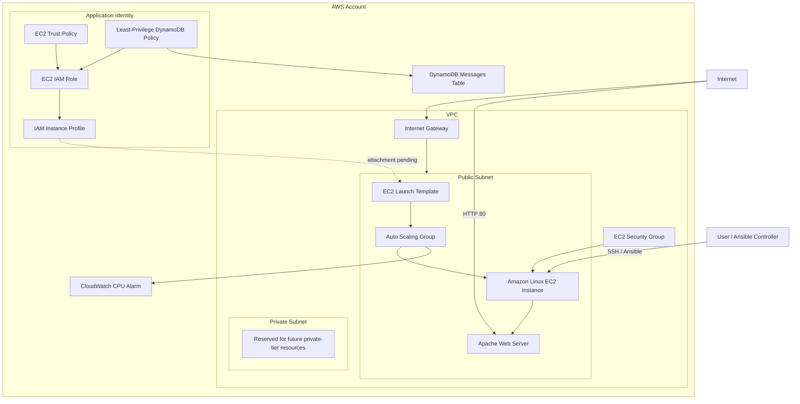
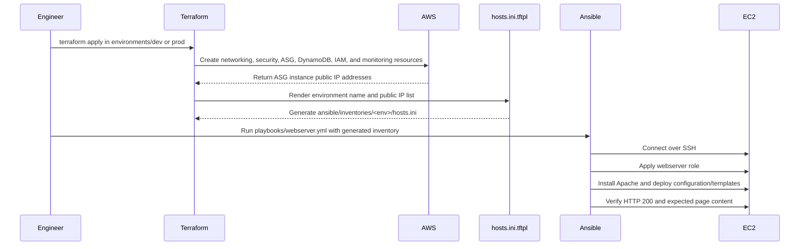
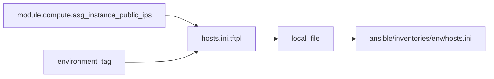
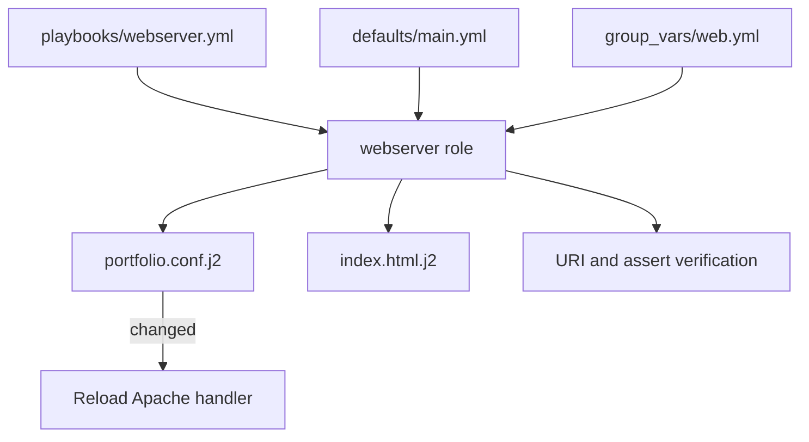

# AWS Infrastructure Automation Portfolio

A cost-conscious infrastructure and configuration-management portfolio built with **Terraform**, **AWS**, and **Ansible**.

The project models the deployment of a web application platform across separate development and production environments. Terraform provisions and composes the AWS infrastructure, generates environment-specific Ansible inventories, and creates the initial application data and IAM resources. Ansible converts the EC2 instances into consistently configured Apache web servers through a reusable role.

> **Project status:** Active development. The current implementation provisions the infrastructure, creates the DynamoDB and IAM resources, generates Ansible inventories, and configures the web tier. Attaching the application instance profile to the Launch Template and validating DynamoDB access from EC2 are the next integration steps.

---

## Project Goals

This repository is designed to demonstrate practical skills relevant to Cloud, Infrastructure, Platform, and DevOps engineering roles:

- Build reusable Terraform modules instead of monolithic configurations.
- Maintain independent `dev` and `prod` root modules and state files.
- Connect Terraform outputs to Ansible automatically.
- Apply repeatable server configuration with Ansible roles, templates, variables, handlers, and verification tasks.
- Use an Auto Scaling Group as the foundation for replaceable compute.
- Externalize application data into DynamoDB as the project evolves toward stateless compute.
- Grant workloads least-privilege AWS access through IAM roles rather than static access keys.
- Keep the lab inexpensive and easy to destroy when it is not in use.

---

## Current Architecture



### Current architectural boundaries

- The Auto Scaling Group currently uses one public subnet and normally runs a single EC2 instance to minimize cost.
- The private subnet is provisioned for future architecture work but is not currently used by the application tier.
- DynamoDB is provisioned as the future persistent data layer for a stateless application.
- The IAM role, table-scoped policy, and instance profile are defined. The profile still needs to be passed into the compute module and attached to the Launch Template.
- There is no Application Load Balancer or scaling policy yet. The current CloudWatch resource is an alarm only.

---

## Terraform and Ansible Workflow



Terraform and Ansible have separate responsibilities:

| Layer | Responsibility |
| --- | --- |
| Terraform | AWS resources, environment composition, dependencies, state, outputs, IAM, and generated inventory files |
| Ansible inventory | Defines the current hosts and environment hierarchy consumed by Ansible |
| Ansible `group_vars` | Supplies environment-specific presentation values for the `web` group |
| Ansible role | Installs and configures Apache, deploys templates, runs handlers, and verifies the web service |

---

## Repository Structure

```text
.
├── README.md
├── .gitignore
│
├── bootstrap/
│   └── remotestate/
│       ├── main.tf
│       ├── data.tf
│       ├── variables.tf
│       └── outputs.tf
│
├── environments/
│   ├── dev/
│   │   ├── main.tf
│   │   ├── variables.tf
│   │   └── outputs.tf
│   └── prod/
│       ├── main.tf
│       ├── variables.tf
│       └── outputs.tf
│
├── modules/
│   ├── networking/
│   ├── security/
│   ├── compute/
│   ├── monitoring/
│   ├── ansible_inventory/
│   ├── dynamodb/
│   └── application_identity/
│
└── ansible/
    ├── inventories/
    │   ├── dev/
    │   │   ├── hosts.ini.example
    │   │   └── group_vars/web.yml
    │   └── prod/
    │       ├── hosts.ini.example
    │       └── group_vars/web.yml
    ├── playbooks/
    │   └── webserver.yml
    └── roles/
        └── webserver/
            ├── defaults/main.yml
            ├── handlers/main.yml
            ├── tasks/main.yml
            └── templates/
                ├── index.html.j2
                └── portfolio.conf.j2
```

The real `hosts.ini` files are generated locally by Terraform and ignored by Git. The committed `.example` files document their expected format.

---

## Terraform Modules

### `networking`

Creates the current network foundation:

- VPC
- Public subnet with automatic public IPv4 assignment
- Private subnet reserved for future use
- Internet Gateway
- Public and private route tables
- Route-table associations

### `security`

Creates the EC2 security group and rules:

- SSH on port `22`
- HTTP on port `80`
- Outbound access
- Automatic detection of the Terraform operator's public IP when an SSH CIDR is not supplied

The automatic SSH rule restricts ingress to a `/32` address rather than opening SSH to the internet.

### `compute`

Creates:

- Latest matching Amazon Linux 2023 AMI lookup
- EC2 Launch Template
- Auto Scaling Group
- ASG instance public-IP discovery output

The current ASG accepts configurable minimum, maximum, and desired capacity values, but uses a single subnet and does not yet have a load balancer or scaling policy.

### `monitoring`

Creates a CloudWatch CPU-utilization alarm scoped to the Auto Scaling Group.

The alarm currently provides visibility only; it is not connected to an Auto Scaling action.

### `ansible_inventory`

Uses the Local provider and Terraform's `templatefile()` function to transform ASG public IP outputs into an Ansible INI inventory.



The generated inventory includes:

- A functional `[web]` group
- Friendly host aliases such as `dev-web-1`
- The current EC2 public IP through `ansible_host`
- A parent environment group such as `[dev:children]`
- Project-specific SSH host-key options for disposable lab instances

### `dynamodb`

Creates one environment-specific messages table:

- Provisioned billing mode
- Configurable read and write capacity, defaulting to `1 / 1`
- String partition key: `pk`
- String sort key: `sk`
- Standard table class
- Configurable deletion protection

Example names:

```text
<project>-dev-messages
<project>-prod-messages
```

The module exposes the table name, ARN, and ID for use by other modules.

### `application_identity`

Creates the workload identity intended for the EC2 application tier:

- EC2 assume-role trust policy
- EC2 IAM role
- Customer-managed DynamoDB permissions policy
- Policy attachment
- IAM instance profile

The permissions policy is restricted to the DynamoDB table ARN received from the current environment and permits only:

- `dynamodb:DescribeTable`
- `dynamodb:GetItem`
- `dynamodb:PutItem`
- `dynamodb:Query`

No application access keys are stored in Terraform or Ansible. Attaching the profile to the Launch Template and testing the temporary EC2 credentials are the next tasks.

---

## Ansible Implementation

### Inventory and environment variables

Terraform creates:

```text
ansible/inventories/dev/hosts.ini
ansible/inventories/prod/hosts.ini
```

Ansible automatically combines each generated inventory with its corresponding variables:

```text
ansible/inventories/<environment>/group_vars/web.yml
```

Development and production use the same playbook and role while receiving different values for:

- `environment_name`
- `page_title`

### `webserver` role

The role currently:

1. Installs Apache (`httpd`).
2. Starts and enables the Apache service.
3. Renders an Apache virtual-host configuration.
4. Notifies a handler when the Apache configuration changes.
5. Reloads Apache only when required.
6. Renders the environment-specific landing page.
7. Verifies that the local web endpoint returns HTTP `200`.
8. Asserts that the expected environment and page title appear in the response.



---

## Remote State

The `bootstrap/remotestate` configuration creates a protected S3 bucket for Terraform state:

- Account-specific bucket name
- Versioning enabled
- AES-256 server-side encryption
- Public access blocked
- Terraform `prevent_destroy` lifecycle protection

Each environment declares its own backend state key so development and production can be managed independently.

> The backend configuration is intentionally kept separate from disposable environment resources and should be treated as long-lived infrastructure.

---

## Prerequisites

Install and configure:

- Terraform 1.x
- AWS CLI with an authenticated profile or supported credential method
- Ansible Core
- An SSH client
- An EC2 key pair whose private key is available locally

The repository intentionally ignores:

- `.tfvars` files
- `backend.hcl`
- Terraform state
- generated Ansible inventories
- SSH private keys
- local `ansible.cfg`

Do not commit credentials, private keys, generated state, or environment-specific secret values.

---

## Deployment Workflow

### 1. Bootstrap remote state

From `bootstrap/remotestate`:

```bash
terraform init -backend-config=backend.hcl
terraform plan
terraform apply
```

Record the backend bucket information returned by Terraform and configure the desired environment's local `backend.hcl`.

### 2. Deploy an environment

From `environments/dev` or `environments/prod`:

```bash
terraform init -backend-config=backend.hcl
terraform fmt -check
terraform validate
terraform plan
terraform apply
```

Terraform provisions the environment and generates:

```text
ansible/inventories/<environment>/hosts.ini
```

### 3. Validate the generated inventory

From `ansible`:

```bash
ansible-inventory \
  -i inventories/dev/hosts.ini \
  --graph
```

Test connectivity:

```bash
ansible \
  -i inventories/dev/hosts.ini \
  web \
  -u ec2-user \
  --private-key ~/.ssh/<private-key>.pem \
  -m ansible.builtin.ping
```

### 4. Configure the web tier

```bash
ansible-playbook \
  -i inventories/dev/hosts.ini \
  -u ec2-user \
  --private-key ~/.ssh/<private-key>.pem \
  playbooks/webserver.yml
```

A second run should normally finish with `changed=0`, demonstrating idempotence.

### 5. Destroy disposable environment resources

From the selected environment directory:

```bash
terraform plan -destroy
terraform destroy
```

The remote-state bootstrap is intentionally separate and is not part of the normal environment-destruction workflow.

---

## Security Decisions

- SSH access defaults to the Terraform operator's detected public IP as a `/32` CIDR.
- Application IAM permissions are scoped to the current environment's DynamoDB table ARN.
- No static application access keys are stored in Terraform, Ansible, EC2 configuration, or the repository.
- State, variable files, backend details, private keys, and generated inventory files are excluded from version control.
- S3 backend data is encrypted, versioned, and protected from public access.
- Development and production resources use independent root modules and are intended to use independent state keys.

The disabled SSH host-key checking in the generated inventory is a deliberate convenience for frequently recreated lab instances. It is not recommended as a general production default.

---

## Cost-Conscious Design

The project is intentionally optimized for short-lived learning deployments:

- Normal ASG desired capacity can remain at one instance.
- No NAT Gateway is currently provisioned.
- DynamoDB starts at `1` provisioned read capacity unit and `1` write capacity unit.
- No Application Load Balancer or managed relational database is currently deployed.
- Development and production environments can be destroyed independently.
- The backend bucket remains separate from disposable resources.

AWS resources can still incur charges. Plans should be reviewed before applying, and environments should be destroyed when they are no longer needed.

---

## Current Status

| Capability | Status |
| --- | --- |
| Modular Terraform networking, security, compute, and monitoring | Implemented |
| Separate development and production roots | Implemented |
| S3 remote state bootstrap | Implemented |
| Launch Template and Auto Scaling Group | Implemented |
| Terraform-generated Ansible inventories | Implemented |
| Reusable Ansible web-server role | Implemented and tested |
| Jinja2 templates, role defaults, handlers, and HTTP verification | Implemented and tested |
| Provisioned DynamoDB messages table | Implemented |
| Table-scoped EC2 IAM role, policy, and instance profile | Implemented |
| Instance profile attached to Launch Template | Pending integration |
| EC2-to-DynamoDB positive and negative permission tests | Pending |
| Stateless application using DynamoDB | Planned |
| Multi-AZ networking and Application Load Balancer | Planned |
| Autonomous configuration of replacement ASG instances | Planned |
| AWS Budget guardrail | Planned |
| CI/CD validation and security scanning | Planned |

---

## Roadmap

### Near term

- Pass the IAM instance-profile name into the compute module.
- Attach the profile to the EC2 Launch Template.
- Replace or refresh the ASG instance and confirm the profile is present.
- Verify `sts get-caller-identity` and table access from EC2 without static credentials.
- Confirm that the development role cannot access the production table.
- Add an AWS monthly budget guardrail.

### Application and stateless-compute phase

- Add a small DynamoDB-backed application role.
- Run the application as a managed systemd service.
- Configure Apache as a reverse proxy.
- Store persistent application data outside EC2.
- Demonstrate that application data survives instance replacement.

### Infrastructure expansion

- Refactor networking for multiple Availability Zones.
- Add an Application Load Balancer, target group, listener, and health checks.
- Attach the target group to the Auto Scaling Group.
- Add a real scaling policy rather than monitoring only.
- Automate configuration of replacement instances through an ASG-compatible mechanism.

### Delivery and quality

- Add Terraform and Ansible linting.
- Add Checkov or tfsec security scanning.
- Add CI/CD validation for pull requests.
- Improve module and role documentation.

---

## Skills Demonstrated

### Terraform

- Root and child module design
- Cross-module inputs and outputs
- Provider requirements and multiple providers
- Remote state
- Environment separation
- Resource and data-source dependencies
- Launch Templates and Auto Scaling Groups
- Terraform templates and generated files
- IAM policy documents and least-privilege policies
- DynamoDB table design
- Cost-aware infrastructure decisions

### Ansible

- Static INI inventory structure
- Terraform-generated inventories
- Inventory groups and `group_vars`
- Reusable roles
- Role defaults
- Jinja2 templates
- Handlers and notifications
- Package and service management
- HTTP verification and assertions
- Idempotent configuration

### AWS

- VPC networking
- EC2 and Auto Scaling
- Security Groups
- IAM roles, policies, and instance profiles
- DynamoDB
- CloudWatch
- S3 state storage

---

## About the Author

This project is part of a professional transition from Windows infrastructure and PowerShell automation toward Cloud and DevOps engineering. It is being developed as a hands-on portfolio to strengthen and demonstrate practical Terraform, Ansible, AWS, infrastructure automation, and configuration-management skills.
