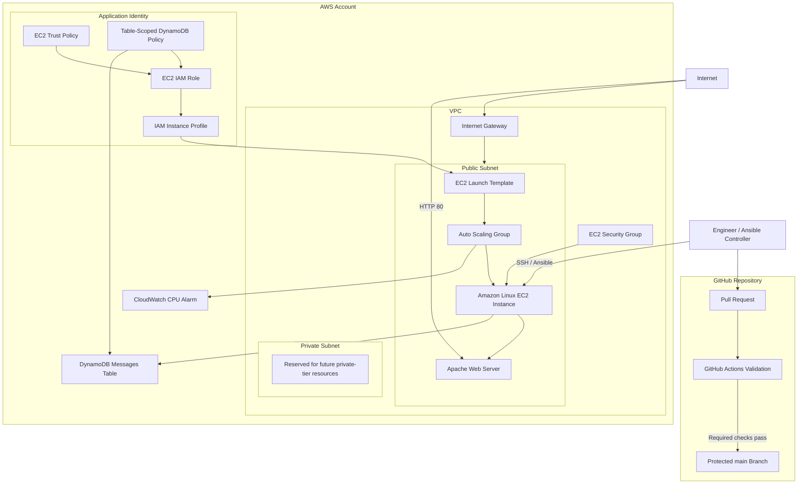
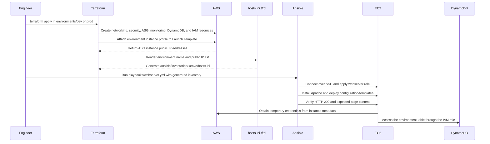
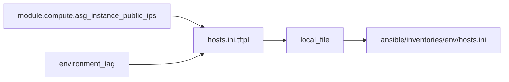
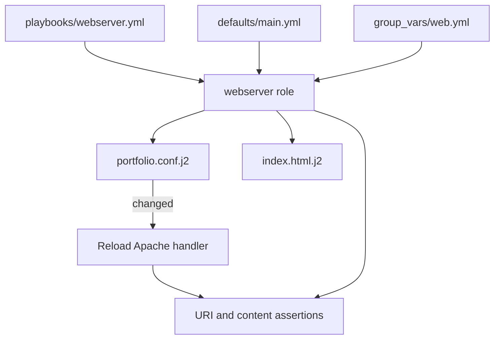
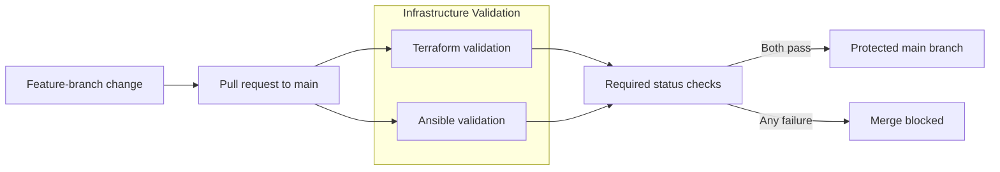

# AWS Infrastructure Automation Portfolio

[](https://github.com/TexMachinna/TerraformPortfolio-AWS/actions/workflows/infrastructure-validation.yml)

A cost-conscious infrastructure and configuration-management portfolio built with **Terraform**, **AWS**, **Ansible**, and **GitHub Actions**.

The project models the automated delivery of an AWS web-server platform across separate development and production environments. Terraform provisions and composes the cloud infrastructure, creates environment-scoped application identity and data resources, and generates Ansible inventories from live infrastructure outputs. Ansible configures the EC2 application tier through a reusable Apache role. GitHub Actions validates both codebases before changes reach the protected `main` branch.

> **Project status:** The current implementation provisions the AWS infrastructure, attaches a least-privilege IAM instance profile to the EC2 Launch Template, generates environment-specific Ansible inventories, configures and verifies the Apache web tier, and validates DynamoDB access from EC2 using temporary role credentials. Terraform and Ansible changes are automatically checked through GitHub Actions.

---

## Project Goals

This repository demonstrates practical skills relevant to Cloud, Infrastructure, Platform, Automation, and DevOps engineering roles:

- Build reusable Terraform modules instead of a monolithic configuration.
- Maintain independent `dev` and `prod` root modules and state files.
- Connect Terraform outputs to Ansible automatically.
- Apply repeatable server configuration through Ansible roles, templates, variables, handlers, and verification tasks.
- Use an Auto Scaling Group as the foundation for replaceable compute.
- Externalize persistent application data into DynamoDB as the project evolves toward stateless compute.
- Grant EC2 workloads least-privilege AWS access through IAM roles instead of static access keys.
- Validate Terraform and Ansible changes automatically before merge.
- Keep the lab inexpensive and easy to destroy when it is not in use.

---

## Current Architecture



### Current architectural boundaries

- The Auto Scaling Group currently uses one public subnet and normally runs one EC2 instance to minimize cost.
- The private subnet is provisioned for future architecture work but is not currently used by the application tier.
- DynamoDB is provisioned as the persistent data layer for a future stateless workload.
- The environment-specific IAM instance profile is attached to the EC2 Launch Template.
- EC2 obtains temporary credentials through the attached role; no application access keys are installed on the instance.
- The current CloudWatch resource is an alarm only and is not connected to a scaling action.
- There is no Application Load Balancer yet.
- The current application payload is intentionally limited to an Apache landing page; the project focuses on infrastructure automation rather than web development.

---

## Infrastructure and Configuration Workflow



Terraform and Ansible have separate responsibilities:

| Layer | Responsibility |
| --- | --- |
| Terraform | AWS resources, module composition, dependencies, state, IAM, outputs, and generated inventory files |
| Ansible inventory | Defines the current hosts and environment hierarchy consumed by Ansible |
| Ansible `group_vars` | Supplies environment-specific values to the shared `web` group |
| Ansible role | Installs and configures Apache, deploys templates, runs handlers, and verifies the web service |
| GitHub Actions | Performs static Terraform and Ansible validation on pull requests and changes to `main` |
| GitHub ruleset | Requires pull requests and successful validation checks before merge into `main` |

---

## Repository Structure

```text
.
├── .github/
│   └── workflows/
│       └── infrastructure-validation.yml
│
├── README.md
├── .gitignore
│
├── bootstrap/
│   └── remotestate/
│       ├── main.tf
│       ├── data.tf
│       ├── variables.tf
│       └── outputs.tf
│
├── environments/
│   ├── dev/
│   │   ├── main.tf
│   │   ├── variables.tf
│   │   └── outputs.tf
│   └── prod/
│       ├── main.tf
│       ├── variables.tf
│       └── outputs.tf
│
├── modules/
│   ├── networking/
│   ├── security/
│   ├── compute/
│   ├── monitoring/
│   ├── ansible_inventory/
│   ├── dynamodb/
│   └── application_identity/
│
└── ansible/
    ├── ansible.cfg
    ├── inventories/
    │   ├── dev/
    │   │   ├── hosts.ini.example
    │   │   └── group_vars/web.yml
    │   └── prod/
    │       ├── hosts.ini.example
    │       └── group_vars/web.yml
    ├── playbooks/
    │   └── webserver.yml
    └── roles/
        └── webserver/
            ├── README.md
            ├── defaults/main.yml
            ├── handlers/main.yml
            ├── meta/main.yml
            ├── tasks/main.yml
            └── templates/
                ├── index.html.j2
                └── portfolio.conf.j2
```

The real `hosts.ini` files are generated locally by Terraform and ignored by Git. The committed `.example` inventories document their expected format and allow CI syntax validation without requiring live EC2 addresses.

---

## Terraform Modules

### `networking`

Creates the current network foundation:

- VPC
- Public subnet with automatic public IPv4 assignment
- Private subnet reserved for future use
- Internet Gateway
- Public and private route tables
- Route-table associations

### `security`

Creates the EC2 security group and rules:

- SSH on port `22`
- HTTP on port `80`
- Outbound access
- Automatic detection of the Terraform operator's public IP when an SSH CIDR is not supplied

The automatic SSH rule restricts ingress to a `/32` address rather than opening SSH to the internet.

### `compute`

Creates:

- Latest matching Amazon Linux 2023 AMI lookup
- EC2 Launch Template
- Environment-specific IAM instance-profile attachment
- Auto Scaling Group
- ASG instance public-IP discovery output

The Auto Scaling Group explicitly consumes the latest Launch Template version. The current deployment uses a single subnet and does not yet include a load balancer or scaling policy.

### `monitoring`

Creates a CloudWatch CPU-utilization alarm scoped to the Auto Scaling Group.

The alarm currently provides visibility only; it is not connected to an Auto Scaling action.

### `ansible_inventory`

Uses the Local provider and Terraform's `templatefile()` function to transform ASG public IP outputs into an Ansible INI inventory.



The generated inventory includes:

- A functional `[web]` group
- Friendly host aliases such as `dev-web-1`
- The current EC2 public IP through `ansible_host`
- A parent environment group such as `[dev:children]`
- Project-specific SSH host-key options for frequently recreated lab instances

### `dynamodb`

Creates one environment-specific messages table:

- Provisioned billing mode
- Configurable read and write capacity, defaulting to `1 / 1`
- String partition key: `pk`
- String sort key: `sk`
- Standard table class
- Configurable deletion protection

Example names:

```text
<project>-dev-messages
<project>-prod-messages
```

The module exposes the table name, ARN, and ID for use by other modules and environment outputs.

### `application_identity`

Creates the EC2 workload identity used by the application tier:

- EC2 assume-role trust policy
- EC2 IAM role
- Customer-managed DynamoDB permissions policy
- Role-policy attachment
- IAM instance profile

The permissions policy receives the current environment's DynamoDB table ARN and permits only:

- `dynamodb:DescribeTable`
- `dynamodb:GetItem`
- `dynamodb:PutItem`
- `dynamodb:Query`

The instance-profile name is passed to the compute module and attached to the EC2 Launch Template. EC2 then obtains temporary credentials automatically from the Instance Metadata Service.

No application access keys are stored in Terraform, Ansible, the repository, or the EC2 configuration.

---

## Ansible Implementation

### Project configuration

The committed `ansible/ansible.cfg` defines portable project-level behavior, including:

- `roles_path = ./roles`
- `remote_user = ec2-user`
- Silent Python-interpreter discovery
- Disabled retry-file generation

The SSH private-key path is intentionally not committed. It can be provided locally with `ANSIBLE_PRIVATE_KEY_FILE` or `--private-key`.

### Inventory and environment variables

Terraform creates:

```text
ansible/inventories/dev/hosts.ini
ansible/inventories/prod/hosts.ini
```

Ansible combines the generated inventory with its corresponding variables:

```text
ansible/inventories/<environment>/group_vars/web.yml
```

Development and production use the same playbook and role while receiving different values for:

- `environment_name`
- `page_title`

### `webserver` role

The reusable role:

1. Installs Apache (`httpd`).
2. Starts and enables the Apache service.
3. Renders an Apache virtual-host configuration.
4. Notifies a handler when the Apache configuration changes.
5. Reloads Apache only when required.
6. Renders the environment-specific landing page.
7. Flushes pending handlers before verification.
8. Verifies that the local web endpoint returns HTTP `200`.
9. Asserts that the expected environment and page title appear in the response.



A second playbook run should normally report `changed=0`, demonstrating idempotent configuration when the desired state has not changed.

---

## GitHub Actions Validation

The repository includes:

```text
.github/workflows/infrastructure-validation.yml
```

The workflow runs on:

- Pull requests targeting `main`
- Pushes to `main`
- Manual execution through `workflow_dispatch`



### Terraform job

The Terraform job:

- Checks out the repository.
- Installs the pinned Terraform version.
- Runs `terraform fmt -check -recursive -diff`.
- Initializes each root module with `-backend=false`.
- Validates:
  - `bootstrap/remotestate`
  - `environments/dev`
  - `environments/prod`

Because backend initialization is disabled, these static checks do not need AWS credentials and do not access or modify remote state.

### Ansible job

The Ansible job:

- Checks out the repository on a separate runner.
- Installs Python and `ansible-dev-tools`.
- Parses the committed development and production example inventories.
- Runs `ansible-lint` across the `ansible` directory.
- Runs `ansible-playbook --syntax-check` against the webserver playbook for both environments.

These checks do not connect to EC2 and do not require an SSH private key.

### Repository governance

The workflow publishes separate status checks for Terraform and Ansible. The `main` branch ruleset requires pull-request validation before merge.

> GitHub branch rulesets are repository settings rather than tracked files, so the rule itself is not represented inside this source tree.

---

## Remote State

The `bootstrap/remotestate` configuration creates a protected S3 bucket for Terraform state:

- Account-specific bucket name
- Object Lock enabled at bucket creation
- Versioning enabled
- AES-256 server-side encryption
- Public access blocked
- Terraform `prevent_destroy` lifecycle protection

Development and production declare independent state keys:

```text
dev/terraform.tfstate
prod/terraform.tfstate
```

This separation allows the environments to be planned, applied, and destroyed independently.

Backend values are supplied locally through an ignored `backend.hcl` file. The remote-state bootstrap is intentionally separated from disposable environment resources and should be treated as long-lived infrastructure.

---

## Prerequisites

Install and configure:

- Terraform compatible with the repository's declared version constraints
- AWS CLI with an authenticated profile or another supported credential method
- Ansible Core and `ansible-lint` for local validation
- An SSH client
- An EC2 key pair whose private key is available locally

The repository intentionally ignores:

- `.tfvars` files
- `backend.hcl`
- Terraform state
- generated Ansible inventories
- SSH private keys
- local environment and credential files

The portable project-level `ansible/ansible.cfg` is committed. Machine-specific private-key paths are not.

---

## Deployment Workflow

### 1. Bootstrap remote state

From `bootstrap/remotestate`:

```bash
terraform init -backend-config=backend.hcl
terraform plan
terraform apply
```

Record the backend bucket information returned by Terraform and configure the selected environment's local `backend.hcl`.

### 2. Deploy an environment

From `environments/dev` or `environments/prod`:

```bash
terraform init -backend-config=backend.hcl
terraform fmt -check
terraform validate
terraform plan
terraform apply
```

Terraform provisions the environment and generates:

```text
ansible/inventories/<environment>/hosts.ini
```

### 3. Configure the local SSH key

For the current terminal session:

```bash
export ANSIBLE_PRIVATE_KEY_FILE="$HOME/.ssh/<private-key>.pem"
```

The key remains outside the repository.

### 4. Validate the generated inventory

From `ansible`:

```bash
ansible-inventory \
  -i inventories/dev/hosts.ini \
  --graph
```

Test connectivity:

```bash
ansible \
  -i inventories/dev/hosts.ini \
  web \
  -m ansible.builtin.ping
```

### 5. Configure the web tier

```bash
ansible-playbook \
  -i inventories/dev/hosts.ini \
  playbooks/webserver.yml
```

Run the playbook again to confirm idempotence.

### 6. Verify the EC2 workload identity

```bash
ansible \
  -i inventories/dev/hosts.ini \
  web \
  -m ansible.builtin.command \
  -a "aws sts get-caller-identity --output json --no-cli-pager"
```

The returned ARN should identify the environment-specific assumed application role rather than an IAM user.

### 7. Verify least-privilege DynamoDB access

Load the table name from the environment output and execute the test from EC2:

```bash
TABLE_NAME="$(terraform -chdir=../environments/dev output -raw table_name)"

ansible \
  -i inventories/dev/hosts.ini \
  web \
  -m ansible.builtin.command \
  -a "aws dynamodb describe-table --table-name ${TABLE_NAME} --region us-east-1 --no-cli-pager"
```

Expected security behavior:

```text
Describe the assigned environment table  -> Allowed
Use an ungranted broad DynamoDB action    -> Denied
Access another environment's table        -> Denied
```

### 8. Destroy disposable environment resources

From the selected environment directory:

```bash
terraform plan -destroy
terraform destroy
```

The remote-state bootstrap is intentionally separate and is not part of the normal environment-destruction workflow.

---

## Security Decisions

- SSH access defaults to the Terraform operator's detected public IP as a `/32` CIDR.
- Application IAM permissions are scoped to the current environment's DynamoDB table ARN.
- The IAM instance profile is attached through the Launch Template so replacement ASG instances inherit the same workload identity.
- EC2 uses temporary role credentials instead of static application access keys.
- State, variable files, backend details, private keys, and generated inventory files are excluded from version control.
- The committed Ansible configuration contains portable project settings only.
- S3 backend data is encrypted, versioned, protected from public access, and protected against accidental Terraform destruction.
- Development and production use independent root modules and state keys.
- Pull requests are subject to automated Terraform and Ansible validation before merge into `main`.

The disabled SSH host-key checking in the generated inventory is a deliberate convenience for frequently recreated lab instances. It is not recommended as a general production default.

---

## Cost-Conscious Design

The project is intentionally optimized for short-lived learning deployments:

- Normal ASG desired capacity can remain at one instance.
- No NAT Gateway is currently provisioned.
- DynamoDB starts at `1` provisioned read capacity unit and `1` write capacity unit.
- No Application Load Balancer or managed relational database is currently deployed.
- Development and production environments can be destroyed independently.
- The backend bucket remains separate from disposable resources.
- CI performs static checks without deploying duplicate validation environments.

AWS resources can still incur charges. Plans should be reviewed before applying, and environments should be destroyed when they are no longer needed.

---

## Current Status

| Capability | Status |
| --- | --- |
| Modular Terraform networking, security, compute, and monitoring | Implemented |
| Separate development and production roots | Implemented |
| Protected S3 remote-state bootstrap | Implemented |
| Launch Template and Auto Scaling Group | Implemented |
| Terraform-generated Ansible inventories | Implemented |
| Reusable Ansible web-server role | Implemented and tested |
| Jinja2 templates, defaults, handlers, and HTTP/content verification | Implemented and tested |
| Environment-specific DynamoDB messages table | Implemented |
| Table-scoped EC2 IAM role, policy, and instance profile | Implemented |
| Instance profile attached to Launch Template | Implemented and tested |
| EC2 temporary-role identity verification | Implemented and tested |
| EC2-to-DynamoDB positive and negative permission tests | Implemented and tested |
| GitHub Actions Terraform validation | Implemented |
| GitHub Actions Ansible inventory, lint, and syntax validation | Implemented |
| Pull-request workflow and required checks for `main` | Implemented |
| Stateless workload using DynamoDB | Planned |
| Multi-AZ networking and Application Load Balancer | Planned |
| Autonomous configuration of replacement ASG instances | Planned |
| AWS Budget guardrail | Planned |
| Terraform security scanning | Planned |
| GitLab merge-request validation pipeline | Planned |

---

## Roadmap

### Delivery and quality

- Extend playbook syntax validation to discover future playbooks automatically.
- Add Terraform security scanning with Checkov or another suitable static-analysis tool.
- Reproduce the validation workflow as a GitLab merge-request pipeline.
- Publish Terraform plan output as a review artifact without automatically applying it.
- Add an AWS monthly budget guardrail.

### Minimal workload validation

- Add a deliberately small Python workload only when needed to exercise the infrastructure.
- Use the existing IAM role and DynamoDB table through the AWS SDK's automatic credential chain.
- Run the workload through a managed `systemd` service.
- Keep application code minimal and use it as an infrastructure test payload rather than a web-development project.

### Infrastructure expansion

- Refactor networking for multiple Availability Zones.
- Add an Application Load Balancer, target group, listener, and health checks.
- Attach the target group to the Auto Scaling Group.
- Add a real scaling policy rather than monitoring only.
- Automate configuration of newly launched or replacement ASG instances.

---

## Skills Demonstrated

### Terraform

- Root and child module design
- Cross-module inputs and outputs
- Provider requirements and multiple providers
- Remote state and environment-specific state keys
- Environment separation
- Resource and data-source dependencies
- Launch Templates and Auto Scaling Groups
- IAM instance-profile integration
- Terraform templates and generated files
- IAM policy documents and least-privilege policies
- DynamoDB table design
- Cost-aware infrastructure decisions
- Automated formatting and configuration validation

### Ansible

- Static INI inventory structure
- Terraform-generated inventories
- Inventory groups and `group_vars`
- Project-level `ansible.cfg`
- Reusable roles
- Role defaults
- Jinja2 templates
- Handlers and notifications
- Package and service management
- HTTP verification and assertions
- Idempotent configuration
- Automated inventory, lint, and syntax validation

### AWS

- VPC networking
- EC2 Launch Templates and Auto Scaling
- Security Groups
- IAM roles, policies, and instance profiles
- Temporary EC2 role credentials
- DynamoDB
- CloudWatch
- Protected S3 state storage

### CI/CD and Repository Governance

- GitHub Actions workflow authoring
- Event-based pull-request and push validation
- Parallel validation jobs
- Least-privilege workflow permissions
- Concurrency controls
- Pinned tool setup
- Required status checks
- Protected-branch workflow
- Infrastructure-code quality gates

---

## About the Author

This project is part of a professional transition toward Cloud and DevOps engineering. It is being developed as a hands-on portfolio to strengthen and demonstrate practical Terraform, Ansible, AWS, IAM, CI/CD, infrastructure-automation, and configuration-management skills.
